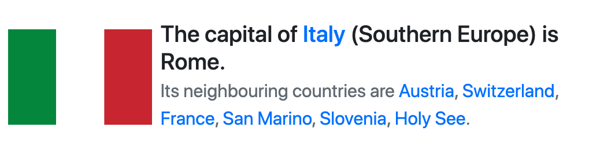

# Fun with countries

This is a simple Node.js web application that fetches country data from a MongoDB Database. This application was written to show how [MongoDB for VS Code](https://www.mongodb.com/products/vs-code) can be helpful to work with MongoDB (no matter if MongoDB runs locally, in Docker or in [Atlas](https://www.mongodb.com/cloud/atlas/signup)) side by side with your application code.

The original dataset comes from https://restcountries.eu/.

## Playgrounds

Playgrounds in MongoDB for VS Code are the easiest way to protoype query, aggregations and any database command in a MongoDB-aware JS environment.

This repository contains 3 playground files:
* [seed-database.mongodb](playgrounds/seed-database.mongodb): fetches the dataset via HTTP (playgrounds support the full Node.js API), stores it in MongoDB and creates an index to make queries faster;
* [random-country.mongodb](playgrounds/queries/random-country.mongodb): includes a couple of aggregations that get a random country from the database;
* [country.mongodb](playgrounds/queries/country.mongodb): includes an aggregation that gets information about a specific country froom the database.

The purpose of playgrounds is to get the environment set up for development ([seed-database.mongodb](playgrounds/seed-database.mongodb)) and iterate on aggregations until the right one is found and can be inserted into the code.

To use playgrounds (and also to make the application work) you will need a MongoDB server:

### Atlas
If you have a cluster in Atlas, you can insert your connection string in `app/index.js` or pass it as an environment variable (`MONGODB_URI`) when you run the application. If you don't have an Atlas cluster, you can get [one for free](https://www.mongodb.com/cloud/atlas/signup)!

### Localhost
If you have MongoDB installed locally, you can just run `mongod` and the application will connect to it by default.

### Docker
`docker-compose up` is the most convenient way to get everything up and running at once. When you bootstrap the Docker environment, MongoDB will be listening on port `27117` to avoid conflicts with a local server.

**In all cases, before you open the application in your browser (http://localhost:3000) you need to [connect VS Code to MongoDB](https://docs.mongodb.com/mongodb-vscode/connect/), open [seed-database.mongodb](playgrounds/seed-database.mongodb) and run it.**

## Explore the data

Once the database is seeded, you will be able to navigate through databases and collections directly from within VS Code and get an overview of the collection's schema and indexes. This information is extremely useful when constructing queries: with a quick look, you'll know what fields are available and which ones are indexed so you can ensure that your query is efficient.

